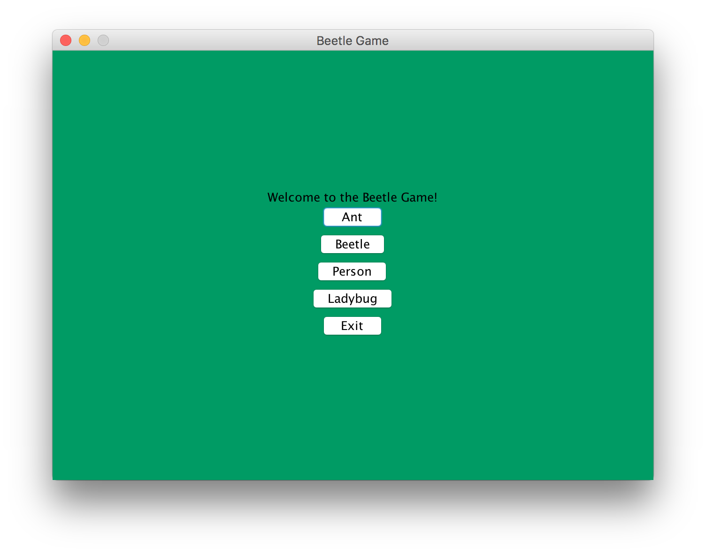
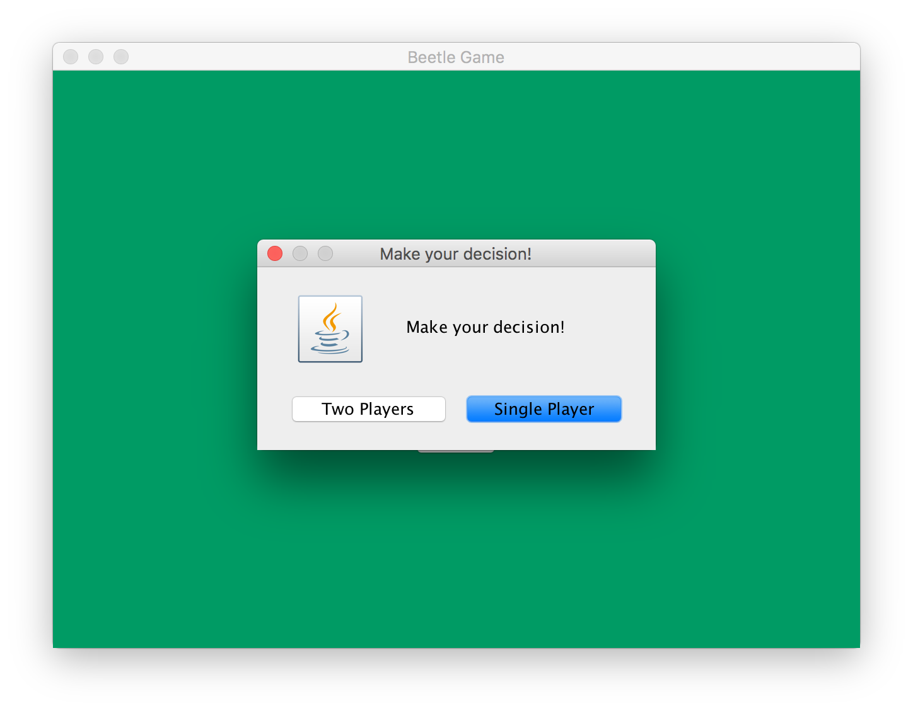
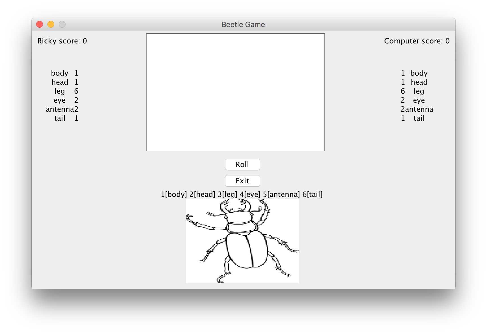
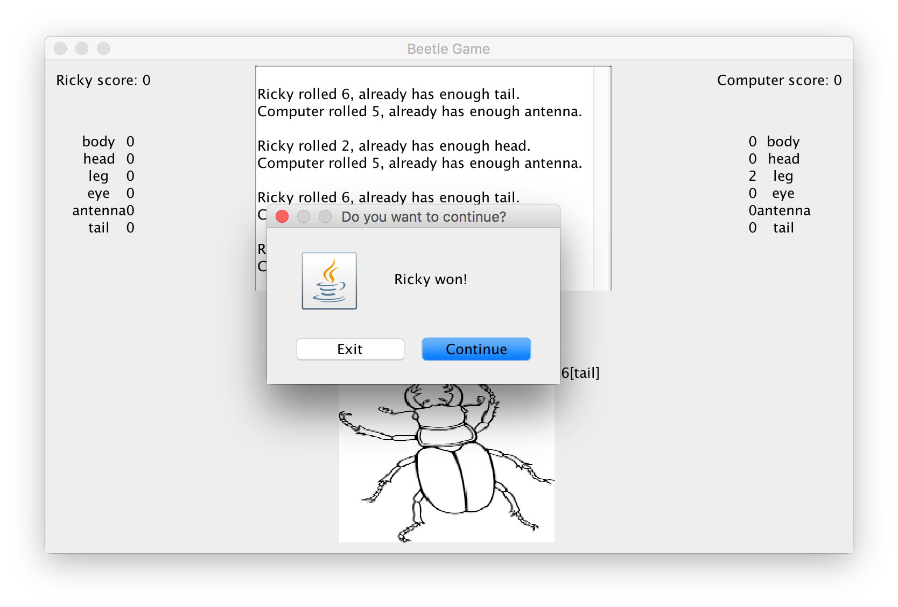

# cs56-games-beetle

## Authors

* W16 READY Hanna
* F16 Yuanqi Samarth

## Testing the Text-based game
To run the text-based game, you can't use ant at the command line. Instead you have to cd into the build directory and then use the command "java edu.ucsb.cs56.projects.games.beetle.BeetleGame -t".

## Project Description

This is a dice rolling game in which the user can choose between four levels: Beetle, Ant, Person, and Ladybug. 
The game can be played against the computer or against another person.
This game is played by clicking a "Roll" button that randomly rolls a value (1-6) for each play. This value corrensponds to the number on a dice and each number represents a body part of the insect/person trying to be created.
The player must first roll the number representing the "body" or "thorax" before adding on other parts of the insect/person.
The game is won by being the first player to roll all parts of the insect/person.

## File Structure

There is a Run.java file which initially starts the game by opening up the start GUI. Each level has its own GUI class along with a class that tracks each player for that level. There is also DrawComponent and DrawPanel files in order to draw graphics for the game.

## Screenshots

## F16 Final Remarks

When the game is launched, there is a menu giving the option of which game mode the user wants to choose. After the user selects which game mode they want (Ant, Beetle, Ladybug, or Person) a prompt displays them asking if they want to play with 1 Player or 2. Then it makes them enter in their name(s), and the actual game GUI displays. In this GUI the user(s) can play the game, rolling the die until one of them wins. After they can choose to replay the game or to quit. 

The user can also select to run the text-based version of game by cd-ing into the build directory and then use the command "java edu.ucsb.cs56.projects.games.beetle.BeetleGame -t". In this game mode, they do the exact same thing as the normal version, except everything is text-based without a GUI. 

The way the code is set up, nothing needs to be refactored as we took care of that. The entry point to the game is the `BeetleGame` class. `GuiBased` and `TextBased` are the two views of the game using the MVC design pattern. All of the game classes such as `Ant` and `Beetle` extend `Player` so if you want to create more game modes, all you have to do is create new classes extending `Player`.

## W16 Final Remarks

When the game is run, the startGUI window appears with options for the level. When a level is selected, the corresponding GUI is launched and an instance of a Player object for that level is created. The GUI class for each level contains the code for the buttons and text fields while the Player class contains for for handling the rolls and adding parts.

The main feature that can be improved is improving the graphics. It would be nice for the user to see the animal being built as they play the game.

A couple of bugs that exist is that the exit window pops up right when the game ends, which can cause confusion as to who won the game. Also, after a game ends and the user selects a new level, the window for entering a name reappears. These are further explained in the Issues section ing Github.

As of now, each level has its own Player class. However, these Player classes are very similar to each other. There is possibility to combine them all into one generic class or create a parent class that they inherit from in order to keep the code DRY.
